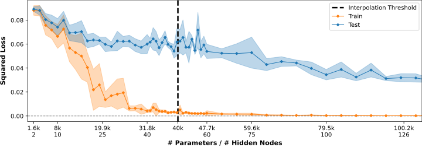
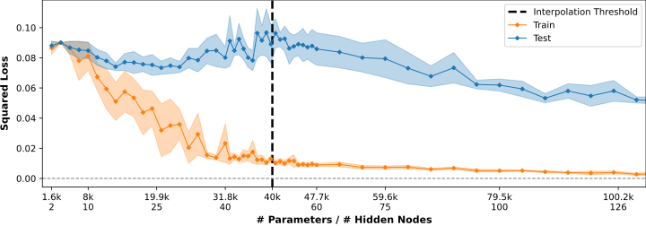
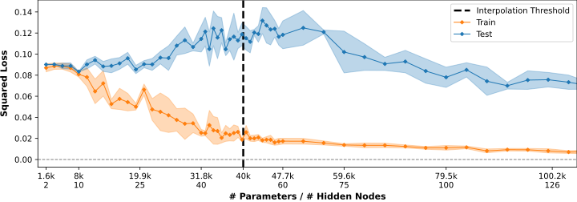

# Analyzing the Double Descent Phenomenon for FCNNs
Analyzing the Double Descent Phenomenon for Fully Connected Neural Networks (Project @ University of Ulm). Have a look at the full [report](/report.pdf).

## Abstract
The double descent risk curve was proposed by Belkin et al. (*Reconciling Modern
Machine-Learning Practice and the Classical Bias–Variance Trade-Off*, 2019) to address the seemingly contradictory wisdoms that 
*larger models are worse* in classical statistics and *larger models are better* in modern machine learning practice. 
As the model size is increased, double descent refers to the phenomenon in which the model performance initially improves, 
then gets worse, and ultimately improves again. In this work, we aim to analyze the occurrence of double descent for 
two-layer fully connected neural networks (FCNN). Specifically, we reproduce and extend the results obtained by Belkin et al.
for FCNNs. We show that, in contrast to their proposed weight reuse scheme, the addition of label noise is an effective 
method to make the presence of double descent apparent. Furthermore, we effectively alleviate the occurrence of double descent 
by employing regularization techniques, namely dropout and L2 regularization.

## Information
The logs and plots of all conducted experiments are provided. 
`log/` contains the configuration and recorded statistics of each experimental setting. 
Based on those, `plot/` contains the corresponding train and test loss curves. 

<p align="center">
  
</p>
<p align="center">
  <em>Experimental results on MNIST dataset (no weight reuse, 0% label noise) </em>
</p>

</br>
<p align="center">
  
</p>
<p align="center">
  <em>Experimental results on MNIST dataset (no weight reuse, 10% label noise)</em>
</p>

</br>
<p align="center">
  
</p>
<p align="center">
  <em>Experimental results on MNIST dataset (no weight reuse, 20% label noise)</em>
</p>


## Preparation
### Installation
```bash
conda create -n double_descent python=3.10
conda activate double_descent

conda install pytorch==2.0.1 torchvision==0.15.2 torchaudio==2.0.2 cpuonly -c pytorch

conda install -c anaconda pyyaml, scikit-learn  # config files / data loading / evaluation
conda install -c conda-forge tqdm, matplotlib  # progress bar & plots
```

### MNIST Dataset
Download the four files that are available on `http://yann.lecun.com/exdb/mnist/`. Unzip and place under:

```
data
└── mnist
    ├── t10k-images.idx3-ubyte
    ├── t10k-labels.idx1-ubyte
    ├── train-images.idx3-ubyte
    └── train-labels.idx1-ubyte
```

## Experiments and Results

### Run Experiment
```
python run.py --config fcnn_mnist_label_noise_0_10
```

### Show Performance Curves
```
python show_results.py --config fcnn_mnist_label_noise_0_10
```

## Configuration

| Type | Parameter | Description | Choices | Belkin at al. | Recommended | Remark | 
| :---: | --- | --- | --- | ---: | ---: | :---: |
| - | `repetitions`                     | Number of repetitions of the same experiment.                 | $r \in \mathbb{N}$      | $5$ | $5$ |
| dataset | `dataset`                   | Dataset for training and testing.                             | *'MNIST'*               | *'MNIST'* | *'MNIST'* |
| dataset | `input_dim`                 | Dimension of data for given dataset.                          | $d \in \mathbb{N}$      | $28 \cdot 28 = 784$| $784$ |
| dataset | `n_classes`                 | Number of classes for given dataset.                          | $c \in \mathbb{N}$      | $10$ | $10$ |
| dataset | `n_train`                   | Number of randomly selected samples/images used for training. | $n \in \mathbb{N}$  | $4,000$ | $4,000$ | **(i)** |
| dataset | `label_noise`               | Amount of synthetic label noise to add.                       | $l \in [0,1]$           | $0.0$ | $0.2$ |
| fcnn | `hidden_nodes`                 | List of numbers specifying the number of hidden nodes of a FCNN (for varying the model complexity). | $[h \in \mathbb{N}]$ | **(ii)** | **(ii)** | **(ii)** |
| fcnn | `final_activation`             | Activation function of output layer.                         | *'none'*, *'softmax'*   | *'none'* | *'none'* |
| fcnn | `weight_reuse`                 | Whether to not use weight reuse, or only in under-parametrized regime, or for all model sizes. | *'none'*, *'under-parametrized'*, *'continuous'* | *'none'*, *'under-parametrized'* | *'none'* |
| fcnn | `weight_initialization`        | Type of weight initialization to use when required. | *'xavier_uniform'* | *'xavier_uniform'* | *'xavier_uniform'* | **(iii)** |
| fcnn | `dropout`                      | Amount of dropout between hidden layer and output layer.      | $d \in [0,1]$ | $0.0$ | $0.0$ |
| training | `loss`                     | Loss function for model optimization.                         | *'squared_loss'*, *'cross_entropy'* | *'squared_loss'* | *'squared_loss'* |
| training | `batch_size`               | Batch size during training.                                   | $b \in \mathbb{N}$ | ? | $128$ |
| training | `n_epochs`                 | Number of training epoch (no early stopping is used).         | $e \in \mathbb{N}$ | $6,000$ | $6,000$ |
| training | `optimizer`                | Optimization method.                                          | *'sgd'* | *'sgd'* | *'sgd'* | **(iv)** |
| training | `learning_rate`            | Learning rate.                                                | $l \in [0,1]$ | ? | $0.1$ |
| training | `weight_decay`             | Amount of weight decay.                                       | $w \in [0,1]$ | $0.0$ | $0.0$ |
| training | `step_size_reduce_epochs`  | Number of epochs after which learning rate is reduced. | $f \in \mathbb{N}$ | $500$ | $500$ | **(v)** |
| training | `step_size_reduce_percent` | Amount of learning rate reduction.                      | $f \in [0,1]$ | $0.1$ | $0.0$ | **(v)** |
| training | `stop_at_zero_error`       | Whether to stop training after zero classification error is achieved. | *'true'*, *'false'* | *'true'* | *'false'* | **(v)** |

**Remarks**

**(i)** For MNIST, we use the full test set (10,000 images) for testing. The train samples for each repetition during an experiment are selected randomly from the full train set (60,000 images). Therefore, the results obtained for different experiments, or even during different repetitions within an experiment, are not necessarily comparable. However, this is not important for the mere observation of the Double Descent.

**(ii)** We don't know the list of $h$ (number of hidden nodes of a FCNN) that Belkin at al. used. However, their model complexity varied between 3,000 and 800,000 parameters/weights, i.e., for their FCNNs they used at least 3 up to 1,000 hidden nodes. In our experiments, we varied the FCNN model complexity between 1,600 and 119,260 parameters by setting `hidden_nodes` to $[2, 4, \dots, 40, 41, \dots, 60, 65, \dots, 150]$.

**(iii)** In general, weights are initialized using standard Glorot-uniform distribution. However, when weights are reused, the remaining weights are initialized with normally distributed random numbers with mean 0.0 and variance 0.01.

**(iv)** SGD (stochastic gradient descent) is used with momentum of $0.95$. 

**(v)**  Belkin et al.: *"For networks smaller than the interpolation threshold, we decay the step size by 10% after each of 500 epochs [...]. For these networks, training is stopped after classification error reached zero or 6000 epochs, whichever happens earlier. For networks larger than interpolation threshold, fixed step size is used, and training is stopped after 6000 epochs"*. We found that these mechanisms have no noticeable impact, and yet their potential influences are difficult to estimate. Therefore, we deactiveded these mechanisms by setting `step_size_reduce_percent` to $0.0$ and `stop_at_zero_error` to *'false'*.
